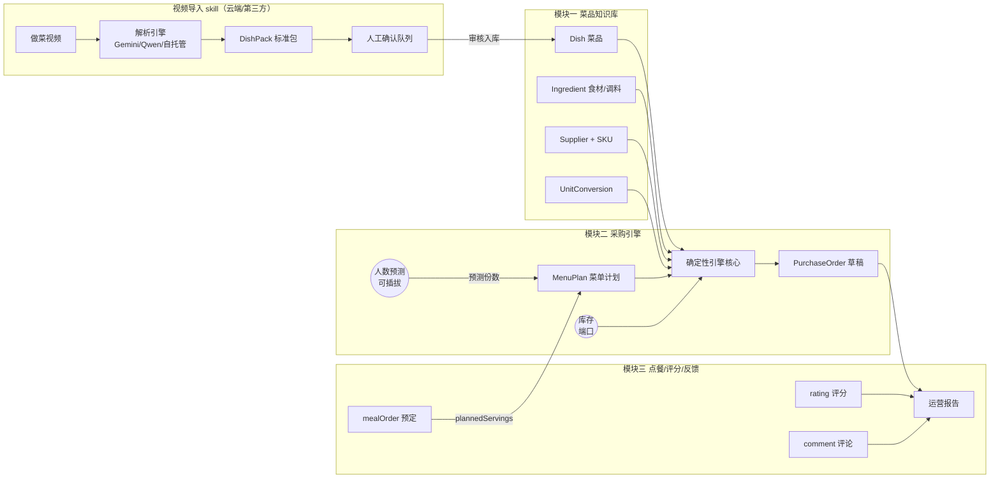
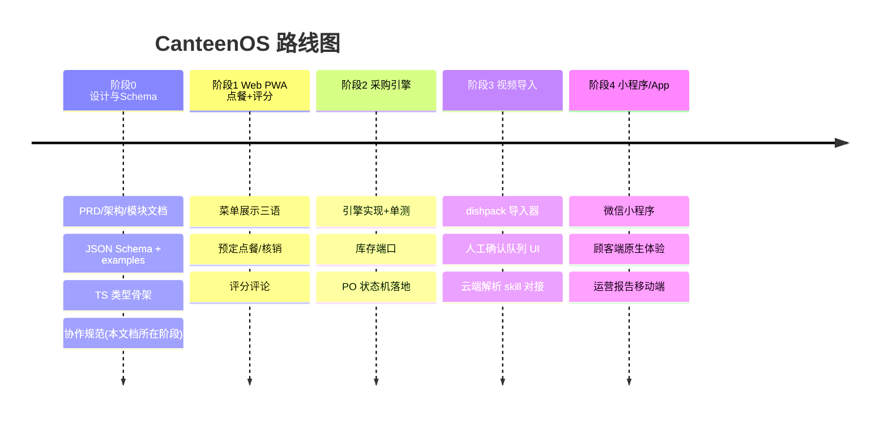

# CanteenOS 总体架构

> **English summary.** CanteenOS is a spec-first monorepo (pnpm workspaces) where JSON Schemas under `schemas/` are the single source of truth; TypeScript types, validated examples, and docs all derive from them. Three bounded modules — knowledge base, menu-plan→procurement engine, and feedback — communicate through schema-defined entities only. The procurement core is a deterministic pure function with pluggable headcount forecasting; video parsing runs off-device (cloud/third-party skill) and the local system only imports standard dishpack bundles. The roadmap runs Phase 0 (design & schemas) → Phase 1 (Web PWA ordering + ratings) → Phase 2 (procurement engine) → Phase 3 (video import) → Phase 4 (mini-program / native apps).

- 关联决策：[ADR-0003 spec-first monorepo](adr/0003-spec-first-monorepo.md)、[ADR-0004 内容级三语](adr/0004-content-level-i18n.md)、[ADR-0005 采购引擎设计](adr/0005-procurement-engine-design.md)

---

## 1. 设计原则

1. **Spec-first**：`schemas/`（JSON Schema draft 2020-12）是单一事实源。类型、示例、文档、未来的服务端/客户端实现都从 schema 派生。变更顺序硬性规定为 schema → types → examples → docs（见 [CONTRIBUTING.md](../CONTRIBUTING.md)）。
2. **模块间只通过 schema 实体通信**：不允许模块私有数据结构逃逸到公共接口。
3. **确定性核心 + 可插拔边缘**：采购引擎是纯函数（同输入必同输出，可单测、可回放）；人数预测、库存查询、价格获取是注入的端口。
4. **格式先行，解析器可替换**：视频导入的交换格式（dishpack）与解析引擎解耦——Gemini / Qwen / 自托管管线产出同一契约（调研报告：「格式先行，解析器可替换是关键解耦点」）。
5. **许可证安全**：不 fork、不复制任何 AGPL/Commons Clause 项目代码（教训见 [ADR-0002](adr/0002-license-apache2.md)）。

## 2. 仓库布局（pnpm workspaces）

```
canteen-os/
├── schemas/            # JSON Schema（单一事实源）
├── examples/           # 通过 CI 校验的样例数据
├── packages/
│   └── core/           # @canteenos/core：TS 类型 + 采购引擎纯函数骨架
│   └── (未来) web/     # 阶段 1：Web PWA
│   └── (未来) api/     # 阶段 1/2：服务端
├── skills/
│   └── video-recipe-ingest/   # 视频解析 skill 契约（云端/agent 实现）
├── scripts/            # 校验脚本（CI 入口）
└── docs/               # PRD / 架构 / 模块 / ADR / 调研
```

## 3. 模块边界



边界规则：

- **知识库 → 采购引擎**：只读 Dish/Ingredient/Supplier/UnitConversion；引擎不反向修改知识库。
- **反馈 → 采购引擎**：通过 MenuPlan.plannedServings 间接影响；引擎不感知顾客。
- **视频 skill → 知识库**：只通过 dishpack + 人工确认队列入库；skill 无权直接写 Dish。

## 4. 技术选型与理由

| 决策点 | 选型 | 理由 |
|---|---|---|
| 数据模型规范 | JSON Schema draft 2020-12 | 语言中立、工具链成熟（ajv）、CI 可校验；draft 2020-12 有稳定 `$defs` 语义 |
| 包结构 | pnpm workspaces monorepo | 多包（core/web/api）共享 schema 与 types；轻量 |
| 核心语言 | TypeScript | 前后端同构；类型与 JSON Schema 映射直接 |
| schema→TS | 手写 types.ts 起步，预留 json-schema-to-typescript 生成 | 阶段 0 规模小，手写更可控；规模上来后切生成 |
| 校验 | ajv (draft 2020-12) + ajv-formats | 事实标准 |
| 菜谱交换格式 | schema.org/Recipe JSON-LD（主）+ Cooklang（人工审阅辅） | 调研报告 §六：JSON-LD 是事实标准；Cooklang 适合 Git 版本管理与人工审校 |
| 视频解析 | Gemini 2.5 Flash（首选）/ Qwen3-VL（备选）/ 自托管 WhisperX+Qwen-VL（大批量） | [video-import.md](video-import.md) 与调研报告成本分析（$0.02–0.05/条） |
| UI i18n | i18next（客户端自理） | 内容级三语在数据模型解决，界面文案用成熟方案 |
| 许可证 | Apache-2.0 | [ADR-0002](adr/0002-license-apache2.md) |

## 5. 关键数据决策（三个必须落实）

1. **可展示文本一律 `I18nString {zh, en, uk}`**（至少其一，fallback zh→en→uk）。见 [i18n.md](i18n.md)。
2. **`Dish.components` 引用 Ingredient（ingredientRef），不内联字符串**。这是采购引擎能跑起来的前提，也是与 schema.org/Recipe 纯字符串 `recipeIngredient` 的关键差异——dishpack 导入时由解析 skill 负责把字符串映射到知识库 Ingredient 并标记匹配置信度。
3. **数量一律 `Quantity {value, unit}`**，跨单位换算通过 UnitConversion 表（食材专属优先，全局兜底）。

## 6. 阶段路线图



| 阶段 | 交付物 | 依赖 |
|---|---|---|
| 0 设计与 Schema | 本仓库当前全部内容 | — |
| 1 Web PWA 点餐+评分 | 菜单浏览（三语）、预定、核销、评分 | schemas: menu-plan, feedback, dish |
| 2 采购引擎 | `packages/core` 引擎实现、PO 生成、库存端口 | 阶段 1 的订餐数据；schemas: supplier, purchase-order |
| 3 视频导入 | dishpack 导入器、人工确认队列、skill 对接 | schemas: dishpack；skills/video-recipe-ingest |
| 4 小程序/App | 微信小程序顾客端、报告移动端 | 阶段 1–3 稳定 |

## 7. Open Questions

1. schema→TS 类型何时从手写切换到生成（json-schema-to-typescript）？切换点建议：实体数 > 15 或嵌套层级 > 4。
2. 服务端持久化选型（PostgreSQL + JSONB 直接存 schema 实体 vs 关系表）留给阶段 1 ADR。
3. 库存端口的最小模型（现货数量？批次/保质期 FEFO？）需要在阶段 2 前定 ADR——调研中 Grocy 的批次模型可参考。
4. 多食堂多租户是否在阶段 1 引入（参考 Mealie Group/Household 模型）。
