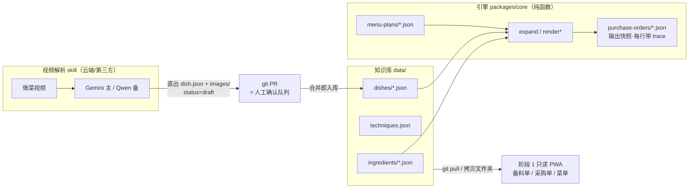
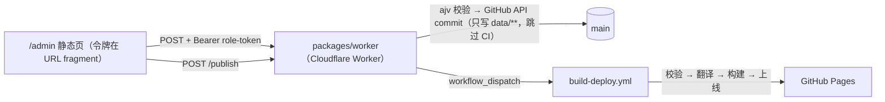

# CanteenOS 总体架构

> **English summary.** CanteenOS is a spec-first monorepo (pnpm workspaces) where JSON Schemas under `schemas/` are the single source of truth; TypeScript types, the `data/` knowledge base, and docs all derive from them. After the v2 scope reduction ([ADR-0006](adr/0006-scope-reduction-v2.md)) the product does one job — *a Chinese chef with a Ukrainian helper cooks Chinese food abroad and buys the right ingredients* — through three daily sheets (prep list / purchase order / menu) over **5 entities**: `ingredient`, `techniques` (single-file vocabulary), `dish`, `menu-plan`, and `purchase-order` (an engine-output snapshot with a per-line trace; no state machine). The repo directory *is* the knowledge base: one file per entity, filename = ID, sync via git pull or copying the folder. The engine is a deterministic pure function (`expand` / `renderPrepList` / `renderPurchaseOrders` / `renderMenu` / `readiness`); the video-ingest skill outputs `dish.json` + `images/` directly and a git PR is the human review queue. The feedback/ordering module is deferred. Roadmap: engine first, then video POC, then the Phase-1 read-only PWA.

- 关联决策：[ADR-0003 spec-first monorepo](adr/0003-spec-first-monorepo.md)、[ADR-0004 内容级三语](adr/0004-content-level-i18n.md)、[ADR-0006 产品收窄与简化（v2）](adr/0006-scope-reduction-v2.md)、[ADR-0007 写入通道](adr/0007-write-channel.md)

---

## 1. 设计原则

1. **Spec-first**：`schemas/`（JSON Schema draft 2020-12）是单一事实源。类型、数据、文档、未来的实现都从 schema 派生。变更顺序硬性规定为 schema → types → data → docs（见 [CONTRIBUTING.md](../CONTRIBUTING.md)）。
2. **目录即知识库**（ADR-0006，调研场景 G）：知识库 = `data/` 下的 JSON + 图片，一实体一文件、文件名即 ID、禁止汇总大文件（`techniques.json` 词表除外）；阶段 1 无数据库、无 API，静态 PWA 直读 JSON，同步靠 git pull 或拷贝文件夹。
3. **确定性核心 + 可插拔边缘**：引擎是纯函数（同输入必同输出，可单测、可回放）；`data/` 现有数字即黄金测试。
4. **解析器可替换**：视频解析引擎（Gemini 主 / Qwen 备，ADR-0006 裁决）输出同一契约——直接产出 `dish.json` + `images/`；git PR 即人工确认队列。
5. **许可证安全**：不 fork、不复制任何 AGPL/Commons Clause 项目代码（教训见 [ADR-0002](adr/0002-license-apache2.md)）；图片逐图存许可元数据（CC BY-SA 裁决）。

## 2. 仓库布局（pnpm workspaces）

```
canteen-os/
├── schemas/            # JSON Schema（单一事实源，5 实体 + common，第一轮冻结）
├── data/               # 知识库本体（一实体一文件、文件名即 ID）
│   ├── ingredients/        # 食材/调料（tomato.json, egg.json, …）
│   ├── techniques.json     # 中餐技法受控词表（单文件合集，cut/heat/pretreat）
│   ├── dishes/             # 菜品（允许不完整：只有名字也能导入）
│   ├── menu-plans/         # 菜单计划（日期×餐次×菜品×份数 + margin）
│   ├── purchase-orders/    # 引擎输出快照（每行带 trace；目录内 README 有验收基准）
│   └── translations.lock.json   # (v0.1) 翻译状态旁文件：source_hash + machine|human
├── packages/
│   ├── core/           # @canteenos/core：类型 + 引擎 + 三个渲染器 + readiness（已实现）
│   ├── web/            # (v0.2) Vite 静态站：/prep /purchase /menu；(v0.3) /admin
│   └── worker/         # (v0.3) 写入通道云函数：后台表单 → GitHub API → 触发构建
├── skills/
│   └── video-recipe-ingest/   # 视频解析 skill 契约（命令行；界面第二轮）
├── scripts/
│   ├── validate-schemas.mjs / local-validate.py   # CI 校验
│   ├── build-data.mjs      # (v0.1) data/ → 三张单 JSON + build.json
│   ├── translate.mjs       # (v0.1) DeepL + 术语表 + lock
│   ├── seed-wikidata.py    # (v0.4) 食材三语名 + 图种子
│   └── create-issues.mjs   # backlog JSON → GitHub issues（幂等）
├── .github/
│   ├── workflows/ci.yml            # 校验 + 测试
│   ├── workflows/build-deploy.yml  # (v0.2) push main → translate → build-data → vite → Pages
│   └── backlog/round-1.json        # 第一轮 issue 清单（事实源）
└── docs/               # PRD / 架构 / 模块 / ADR / 调研 / design(高保真) / field-test / 计划与执行简报
```

标 (vX.Y) 的是第一轮里程碑要交付的，见 `docs/execution-brief.md` §2–§3。

## 3. 模块边界



边界规则：

- **引擎 → 知识库**：只读 ingredients/techniques/dishes/menu-plans；输出只写 purchase-orders/（快照，不回流修改知识库）。
- **视频 skill → 知识库**：只通过 `draft` 菜品 + git PR 入库；skill 无权直接改 active 菜品。
- **deleted 边界**（ADR-0006）：无供应商实体（supplier 是字符串）、无量纲实体（pcs↔g 走 `pcsToGram`）、无反馈模块（deferred）、无 PO 状态机。

### 3.1 写入通道（v0.3，[ADR-0007](adr/0007-write-channel.md)）

阶段 1 仍然没有数据库、没有登录、没有自建服务器。师傅在 `/admin` 里的每一次保存走的是这条链：



边界规则（展开见 ADR-0007 §5、§7、§8）：

- **worker → 仓库**：只能写 `data/**`；`schemas/`、代码、`.github/**` 一律拒绝，且 worker 的凭据本身不含 workflows 权限——即使被攻破也改不了 CI。
- **写入 ≠ 发布**：写入的 commit 带 `[skip ci]`，不触发部署；`/admin` 顶部的「N 项未发布」= `main` 上动过 `data/` 的 commit 与线上 `build.json.commit` 的差集；发布是师傅点的那一下（`workflow_dispatch`）。
- **无身份**：令牌按角色（chef / buyer / admin）随机生成、放在链接的 fragment 里（不进 Referer 与服务端日志），worker 只存 SHA-256 哈希，不存任何个人信息；泄露的处置是改一个 secret 重发链接。
- **回退**：新 commit 把 `data/` 恢复到某个历史 sha，绝不 force push，且回退本身也要点一次发布才上线。

## 4. 技术选型与理由

| 决策点 | 选型 | 理由 |
|---|---|---|
| 数据模型规范 | JSON Schema draft 2020-12 | 语言中立、工具链成熟（ajv）、CI 可校验；draft 2020-12 有稳定 `$defs` 语义 |
| 包结构 | pnpm workspaces monorepo | core/web 共享 schema 与 types；轻量 |
| 核心语言 | TypeScript | 前后端同构；类型与 JSON Schema 映射直接 |
| schema→TS | 手写 types.ts 起步，预留 json-schema-to-typescript 生成 | 规模小，手写更可控；实体数 > 15 或嵌套层级 > 4 时切生成 |
| 校验 | ajv (draft 2020-12) + ajv-formats；无 Node 环境用 `scripts/local-validate.py` | 事实标准 + 零依赖兜底 |
| 知识库存储 | git 仓库 `data/`（一实体一文件） | 场景 G：electron/apps 式数据仓库已验证；前提三件套 = schema 校验 CI + 图片压缩管线 + 实体分片 |
| 视频下载/解析 | yt-dlp（Unlicense，ADR-0006 裁决可用）；Gemini 主 / Qwen 备 | 场景 C：全宽松协议链路；Gemini 服务端强制 JSON Schema，Qwen 国内合规 |
| 写入通道 | 静态后台 → Cloudflare Worker → GitHub API → Actions 构建 | [ADR-0007](adr/0007-write-channel.md)：唯一能同时满足「无数据库 / 无登录 / 无自建服务」且密钥不进浏览器的形状 |
| UI i18n | i18next（客户端自理） | 内容级三语在数据模型解决，界面文案用成熟方案 |
| 许可证 | Apache-2.0 | [ADR-0002](adr/0002-license-apache2.md) |

## 5. 关键数据决策（三个必须落实）

1. **可展示文本一律 `I18nString {zh, en, uk}`**（至少其一，fallback zh→en→uk）；翻译状态走旁文件 `translations.lock.json`（脚本维护 source_hash + status），数据本体只有纯三语文本。见 [i18n.md](i18n.md)。
2. **`Dish.components` 引用 Ingredient（ingredientRef），不内联字符串**；`techniqueRef` 只能引用 `data/techniques.json` 闭集词表——这是采购引擎能跑通、视频解析输出可校验的前提。
3. **数量一律 `Quantity {value, unit}`**；单位枚举 `g|kg|ml|l|pcs|pack|tbsp|tsp|pinch`。量纲规则（ADR-0006 收窄）：**g↔kg、ml↔l 是代码常量；pcs↔g 只靠 `ingredient.pcsToGram`**——无独立换算实体、无生效期与优先级链；换算失败进人工确认，引擎绝不猜测。

## 6. 路线图（2026-09-07 起以两份文件为准）

路线图已迁出本文：节奏、日期、三道门在 [`plan-for-terry.md`](plan-for-terry.md)；每个版本的任务、完成定义、接口契约在 [`execution-brief.md`](execution-brief.md)；目标对齐分析与第二轮以后的触发条件在 [`roadmap-v2.md`](roadmap-v2.md)。

一句话版：**v0.1 收尾工程（9/13）→ v0.2 三张单上屏（9/27）→ v0.3 师傅后台（10/11）→ v0.4 真实数据（10/18）→ 真实厨房周（10/19–25）→ v1.0（10/30）**。写入通道（静态后台 → 云函数 → GitHub API）由 [ADR-0007](adr/0007-write-channel.md) 定案，是第一轮唯一的新 ADR。

## 7. Open Questions

1. schema→TS 类型何时从手写切换到生成（json-schema-to-typescript）？切换点建议：实体数 > 15 或嵌套层级 > 4。
2. 静态 PWA 的离线缓存与图片体积控制（Workbox 运行时 CacheFirst + 图片源头压缩 CI，场景 G 已知坑 #1/#4）。
3. translations.lock.json 维护脚本与 CI 一致性检查（旁文件与数据本体漂移兜底）。
4. margin=1.1 在小批量（如 10 份）时是否足够覆盖固定尾料——上线后实测校正。
