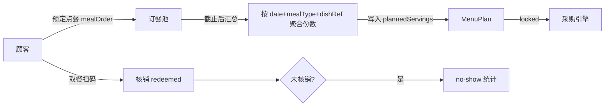

# 模块三：点餐 / 评分 / 反馈（Feedback）

> **English summary.** The feedback module closes the loop: customers pre-order meals (mealOrder) which drive `plannedServings` in menu plans, redeem orders by scanning, then rate dishes (1–5 stars + controlled tags) and comment (original text plus trilingual translations). Aggregated metrics — dish popularity (order volume), reputation (rating distribution), no-show rate, tag concentration — feed both the menu planner and weekly/monthly operations reports covering dish leaderboards, procurement accuracy, cost, and waste signals. Reference: the role model and pre-order→headcount flow of itsHenry35/canteen-management-system (research report §3.2).

- schema：`schemas/feedback.schema.json`
- 样例：`examples/feedback-meal-order.example.json`、`feedback-rating.example.json`、`feedback-comment.example.json`

---

## 1. 数据模型表

### Feedback（三态合一：mealOrder / rating / comment）

| 字段 | 类型 | mealOrder | rating | comment | 说明 |
|---|---|---|---|---|---|
| id / schemaVersion | — | ✅ | ✅ | ✅ | |
| type | enum | ✅ | ✅ | ✅ | 判别字段 |
| dishRef | Id | ✅ | ✅ | ✅ | 关联菜品 |
| date | date | ✅ | ✅ | ✅ | 用餐日 |
| mealType | enum | ✅ | | | 仅预定点餐必填 |
| customerRef | string | ✅ | ✅ | ✅ | 匿名化顾客标识，不存 PII |
| servings | int ≥1 | ✅ | | | 预定份数 |
| orderStatus | enum | ✅ | | | reserved / redeemed / cancelled / no-show |
| rating | int 1–5 | | ✅ | | |
| tags | enum[] | | ○ | ○ | 受控词表：too-salty / portion-small / fresh / would-reorder 等 9 项 |
| comment | object | | | ✅ | originalLang + original + translations(I18nString 可选) |
| createdAt | date-time | ✅ | ✅ | ✅ | |

schema 用 `if/then` 按 type 施加条件必填（见 `feedback.schema.json` 的 `allOf`）。

## 2. 关键流程

### 2.1 预定点餐 → 驱动 plannedServings

规则：

- 订餐截止（如前一日 18:00，per-canteen 可配——Open Question）后聚合，写入/更新 MenuPlan.plannedServings；chef 仍可人工上调（备餐余量）。
- no-show 率高的菜品/人群反馈给人数预测器（模块二可插拔端口）。

### 2.2 评分与评论

- 评分窗口：核销后 48 小时内（防刷）。
- 评论三语存储：`original`（原文，永不覆盖）+ `translations`（机器初稿可人工修），详见 [../i18n.md](../i18n.md) §5。
- 标签为受控词表，schema 枚举约束；扩充词表走 schema 变更流程。

## 3. 指标与运营报告规格

### 3.1 菜品指标

| 指标 | 定义 |
|---|---|
| 热度 | 周期内 redeemed 份数 |
| 口碑 | 平均评分 + 评分分布（1–5 星占比） |
| 复购意愿 | `would-reorder` 标签占评分人数比 |
| 问题集中度 | 各负向标签（too-salty 等）出现率 |

### 3.2 周/月运营报告规格

| 板块 | 内容 | 数据来源 |
|---|---|---|
| 菜品榜 | 热度 TOP/BOTTOM 10、口碑 TOP/BOTTOM 10 | feedback |
| 采购准确度 | 计划采购量 vs 实际消耗（收货回写后）的偏差率 | purchase-order + 收货记录 |
| 成本 | 周期内 settled PO 总额、单份成本趋势 | purchase-order |
| 浪费反馈 | no-show 率、份量类标签（portion-small/large）集中度、剩菜反馈 | feedback |

报告输出形态（阶段 1 后定）：JSON 数据集 + 可视化由客户端渲染。

## 4. 边界情况

| 情况 | 处理 |
|---|---|
| 未核销就评分 | 阶段 1 允许（宽松策略）但标记 `unverified`；指标口径默认只统计已核销 |
| 同一顾客对同一餐次重复评分 | 后者覆盖前者，历史保留 |
| 评论含辱骂/敏感内容 | 不自动删除；进管理员审核列表（机器预筛 + 人工） |
| 顾客语言不在三语内（如俄语评论） | originalLang 当前枚举仅 zh/en/uk——Open Question #3 |
| 订餐截止后修改/取消 | 不允许修改份数；允许取消但计入 no-show 口径外单独统计 |
| 菜品当天临时更换 | 已预定订单标记 cancelled 并通知；热度指标按实际出餐菜品记 |

## 5. 开放问题（Open Questions）

1. 订餐截止时间是否 per-canteen 配置？默认值取多少？
2. 评分是否允许匿名（customerRef 用一次性令牌）？隐私与防刷的权衡。
3. comment.originalLang 枚举是否扩充（ru/pl 等）？与 i18n.md 新增语言策略联动。
4. "采购准确度"需要实际消耗数据，来源是收货记录、库存盘点还是人工登记？与模块二 Open Question #2 联动。
5. 标签词表 9 项是否够用？扩充节奏与治理方式。
