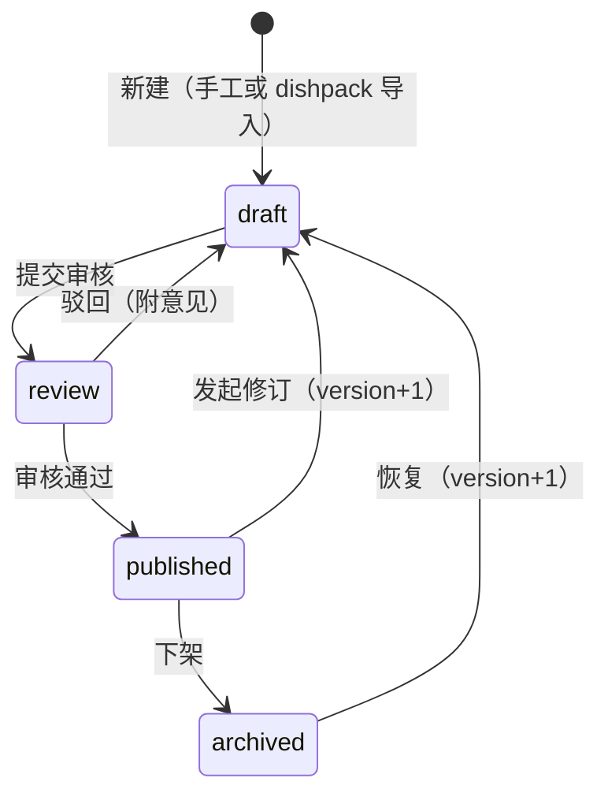
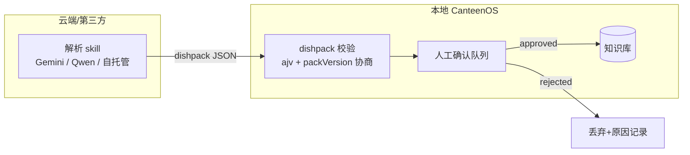

# 模块一：菜品知识库（Knowledge Base）

> **English summary.** The knowledge base holds all dish-domain entities — Dish, Ingredient (seasonings included via `isSeasoning`), Supplier with SKUs, UnitConversion, and DishPack import bundles — under a `draft → review → published` (+`archived`) state machine with monotonic versioning. Extensibility comes from the dishpack mechanism: cloud/third-party parsing skills emit a single JSON-LD-based contract, and the local system only imports validated bundles through a human review queue; online/offline sync is bundle-based. Data-model borrowings: Tandoor's Food/Unit/Ingredient separation (concept only — AGPL+Commons Clause bars code reuse) and Grocy's recipe×inventory×price linkage (MIT).

- schema：`schemas/dish.schema.json`、`ingredient.schema.json`、`supplier.schema.json`、`dishpack.schema.json`、`common.schema.json`
- 样例：`examples/dish-tomato-egg.example.json` 等

---

## 1. 数据模型表

### Dish（菜品）

| 字段 | 类型 | 必填 | 说明 |
|---|---|---|---|
| id | Id | ✅ | kebab-case 稳定 ID |
| schemaVersion | `"1"` | ✅ | 实体 schema 版本 |
| name | I18nString | ✅ | 三语菜名 |
| description | I18nString | | |
| category | enum | ✅ | staple / meat-dish / vegetable-dish / soup / cold-dish / snack / dessert / drink |
| cuisine | string | | 菜系，自由文本 |
| baseServings | int ≥1 | ✅ | 配方基准份数（缩放基数） |
| components[] | object | ✅ ≥1 | ingredientRef + Quantity + lossRateOverride + note + confidence |
| steps[] | object | ✅ ≥1 | order + instruction(I18nString) + durationMinutes + tools |
| provenance | object | | source ∈ manual / video-import / web-import；视频导入必填 videoUrl 等溯源字段 |
| tags | string[] | | |
| version | int ≥1 | ✅ | 内容版本，每次修改 +1 |
| status | enum | ✅ | draft / review / published / archived |

### Ingredient（食材/调料）

| 字段 | 类型 | 必填 | 说明 |
|---|---|---|---|
| id / schemaVersion / name | — | ✅ | 同 Dish 约定 |
| category | enum | ✅ | vegetable / meat / egg-dairy / grain-staple / seasoning / oil / … |
| isSeasoning | bool | ✅ | 调料与主料的唯一区分位 |
| baseUnit | Unit | ✅ | 库存与采购聚合的基准单位 |
| lossRate | 0–1 | | 加工损耗率（默认 0） |
| storageType | enum | | ambient / chilled / frozen |
| shelfLifeDays | int | | 保质期（配合采购提前期校验） |
| allergens | enum[] | | EU 1169/2011 十四类过敏原 |
| nutrition.per100g | object | | kcal / proteinG / fatG / carbsG |
| unitConversions[] | UnitConversion[] | | 食材专属换算（如鸡蛋 1 pcs = 55 g） |

### Supplier（供应商 + SKU）

| 字段 | 类型 | 必填 | 说明 |
|---|---|---|---|
| id / schemaVersion / name / contact | — | ✅(前四) | |
| skus[].skuId | string | ✅ | 包装 SKU 标识 |
| skus[].ingredientRef | Id | ✅ | 绑定食材 |
| skus[].packageSize / packageUnit | number + Unit | ✅ | 单包装净含量 |
| skus[].price | Money | ✅ | 单包装价格 |
| skus[].moq | int ≥1 | | 最小起订量（包装数，默认 1） |
| skus[].leadTimeDays | int ≥0 | ✅ | 下单→到货自然日 |
| skus[].isPreferred | bool | | 同食材多 SKU 时的首选标记 |

### DishPack（视频导入标准包）

见 [../video-import.md](../video-import.md) §3。核心：manifest.recipe（JSON-LD）+ ingredientMappings（含置信度）+ transcript + reviewQueue。

## 2. 版本与状态机

规则：

- 只有 `published` 的 Dish 可被 MenuPlan 引用、被采购引擎展开。
- 每次状态迁移到 `draft` 之外的变更必须 `version + 1`；历史版本保留以支撑 PO 追溯（采购单生成时记录所引 Dish 的 version）。
- 视频导入的 Dish 一律从 `draft` 起步，且 provenance.source = `video-import`。

## 3. 可扩展性设计

### 3.1 dishpack 导入包

- 本地**只做导入**：校验 → 人工确认 → 合成 Dish draft。解析逻辑永不进本仓库实现（见 PRD 非目标）。
- `packVersion` 独立于实体 schemaVersion，允许交换格式与存储格式各自演进。

### 3.2 线上线下同步策略

- 知识库是**服务端权威**（server-authoritative）；线下（如档口断网）只读缓存最近 published 快照。
- dishpack 支持**纯文件流转**：无网环境可先导出 pack 文件，恢复网络后批量导入。
- 冲突规则：服务端 version 高于本地时以服务端为准；本地不产生写冲突（写操作必须在线）。

## 4. 边界情况

| 情况 | 处理 |
|---|---|
| dishpack 中 ingredientRef 匹配不到现有食材 | ingredientRef 留空 + needsReview=true；人工决定新建 Ingredient 或改映射（Open Question #2） |
| 导入菜与现有菜品重名 | 导入器按名称相似度提示合并或新建；不自动覆盖 |
| Ingredient 被 Dish 引用时需要归档 | 软删除：archived 食材禁止新增引用，历史 Dish 与 PO 不受影响 |
| 调料用量过小（3 g 盐 × 480 份 = 1.44 kg）低于采购 MOQ | 正常——采购侧按 MOQ 取整，知识库侧不改数据 |
| 多语言名称缺失 | I18nString anyOf 保证至少一语言；展示走 fallback 链（见 i18n.md） |
| 单位无法换算（如 pcs → ml） | UnitConversion 查表失败即报错进人工处理，引擎不猜测（见 procurement.md） |

## 5. 开放问题（Open Questions）

1. Dish 历史版本的存储形态（全量快照 vs diff）？影响 PO 追溯实现。
2. ingredientMappings 匹配失败时是否允许解析 skill 自动创建 Ingredient 草稿？
3. 半成品/子菜谱（递归 BOM，参考 OpenKitchen）是否引入 Dish.components 的 `dishRef` 分量类型？当前只支持 ingredientRef。
4. 营养数据是否接入 OpenFoodFacts（Tandoor 的做法）？
