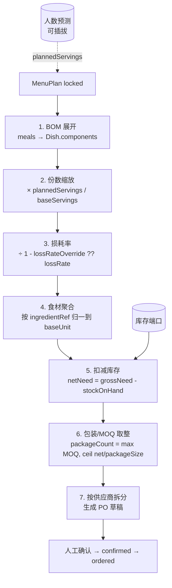
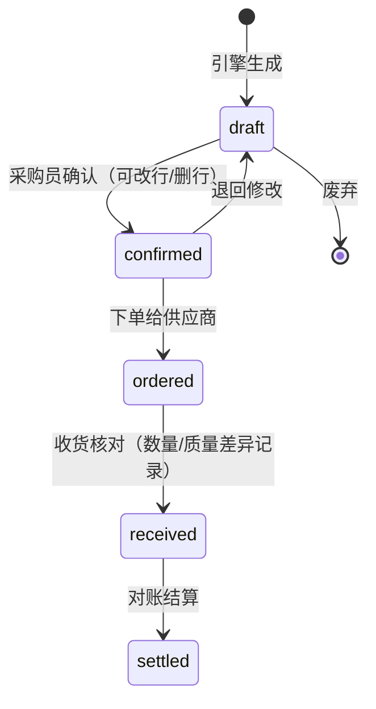

# 模块二：菜单计划 → 采购单引擎（Procurement Engine）

> **English summary.** The procurement engine converts a MenuPlan (date × meal type × dish × planned servings) into per-supplier purchase-order drafts through a deterministic seven-step pipeline: BOM expansion → serving scaling (plannedServings/baseServings) → loss-rate application → ingredient aggregation → inventory deduction → package/MOQ round-up → per-supplier PO split. The core is a pure function; headcount forecasting is pluggable and inventory access is an injected port. POs follow a `draft → confirmed → ordered → received → settled` state machine. The design follows the Odoo MRP paradigm ("BOM explosion → aggregate by supplier → PO") — a paradigm absent from open-source recipe software, which stops at household shopping lists (research report §5). Full worked example with numbers: `examples/menu-plan-week41.example.json` → the two PO examples.

- 关联决策：[../adr/0005-procurement-engine-design.md](../adr/0005-procurement-engine-design.md)
- schema：`menu-plan.schema.json`、`purchase-order.schema.json`、`unit-conversion.schema.json`（量纲换算规则，见 [unit-conversion.md](unit-conversion.md)）
- 代码骨架：`packages/core/src/procurement/engine.ts`

---

## 1. 数据模型表

### MenuPlan（菜单计划）

| 字段 | 类型 | 必填 | 说明 |
|---|---|---|---|
| id / schemaVersion | — | ✅ | |
| name | I18nString | | |
| dateRange | {start, end} | ✅ | ISO date |
| meals[] | object | ✅ ≥1 | date + mealType(breakfast/lunch/dinner) + dishRef + plannedServings |
| status | enum | ✅ | draft / published / locked（locked 后才允许生成 PO） |

### PurchaseOrder（采购单）

| 字段 | 类型 | 必填 | 说明 |
|---|---|---|---|
| supplierRef | Id | ✅ | 每张 PO 只属一个供应商 |
| menuPlanRef | Id | | 溯源：由哪个菜单计划生成 |
| lines[] | object | ✅ ≥1 | ingredientRef + skuId + qty + unit + packageCount + unitPrice + amount |
| totalAmount | Money | ✅ | Σ lines.amount |
| status | enum | ✅ | draft → confirmed → ordered → received → settled |
| dates | object | ✅ createdAt | confirmedAt / orderedAt / expectedAt(=下单日+leadTimeDays) / receivedAt / settledAt |

## 2. 关键流程



### 伪代码（与 `packages/core/src/procurement/engine.ts` 骨架一一对应）

```text
function planProcurement(menuPlan, dishes, ingredients, suppliers, unitConversions, ctx):
    # 1-2. BOM 展开 + 缩放
    requirements = []
    for meal in menuPlan.meals:
        dish = dishes[meal.dishRef]               # 缺失 → error missing-dish
        scale = meal.plannedServings / dish.baseServings
        for comp in dish.components:
            qty = comp.quantity * scale
            requirements.push({meal, comp, qty})

    # 3. 损耗率（采购量放大）
    for r in requirements:
        loss = r.comp.lossRateOverride ?? ingredients[r.comp.ingredientRef].lossRate ?? 0
        r.grossQty = r.qty / (1 - loss)

    # 4. 聚合：换算到 baseUnit 后按 ingredientRef 求和
    #    量纲换算调用点①：resolveConversionFactor(rules, {ingredientRef, dishRef,
    #    from, to, asOfDate: meal.date})——优先级链 菜品特定 > 食材特定 > 全局通用，
    #    按各 meal 当日生效的规则解析（unit-conversion.md §3）
    aggregated = {}
    for r in requirements:
        qtyBase = convert(r.grossQty, to: ingredients[ref].baseUnit, unitConversions)
                        # 换算失败 → error unit-conversion-missing，绝不猜测
        aggregated[ref] += qtyBase

    # 5. 扣减库存（端口注入，可为空表=不扣减）
    for ref, need in aggregated:
        netNeed[ref] = max(0, need - ctx.inventory[ref] ?? 0)

    # 6-7. 选 SKU、取整、拆单
    for ref, net in netNeed where net > 0:
        sku = selectSku(suppliers, ref)           # isPreferred 优先；无 SKU → error no-supplier
        packs = max(sku.moq ?? 1, ceil(netInPackageUnit / sku.packageSize))
        #    量纲换算调用点②：baseUnit → sku.packageUnit，同样走
        #    resolveConversionFactor，asOfDate = menuPlan.dateRange.end
        poLines[sku.supplier].push({ingredientRef: ref, skuId: sku.skuId,
                                    qty: packs * sku.packageSize, unit: sku.packageUnit,
                                    packageCount: packs, unitPrice: sku.price,
                                    amount: packs * sku.price})
    return {purchaseOrders: splitBySupplier(poLines), errors, trace}
```

### 量纲换算的调用点与生效期语义

量纲转换规则是一等公民实体 UnitConversionRule（模型与优先级链见 [unit-conversion.md](unit-conversion.md)）。引擎在**步骤 4（聚合归一）**与**步骤 6（包装取整）**两处调用换算，统一语义为"**按菜单日期取当日生效的规则**"：步骤 4 用各 `meal.date`，跨规则生效边界的菜单周按日换算后再聚合；步骤 6 用 `menuPlan.dateRange.end`。规则带 `[effectiveFrom, effectiveTo)` 生效区间并以 `supersedes` 形成版本链，因此历史采购单按原日期可复算，调整量纲不污染历史。查表失败一律 `unit-conversion-missing`，绝不猜测。

### 完整推导样例（examples 数字自洽）

MenuPlan `menuplan-2026-w41`：番茄炒蛋 200 + 160 + 120 = **480 份**，scale = 480/2 = 240。

| 食材 | 每份基准（2 份配方） | ×240 | ÷(1−loss) | 聚合需求 | 取整（示例未扣库存） |
|---|---|---|---|---|---|
| 番茄 | 300 g | 72000 g | ÷0.90 = 80000 g | 80 kg | 16 × 5 kg 装（GF-TOM-5KG）→ **456 元** |
| 鸡蛋 | 3 pcs | 720 pcs | ÷0.89 ≈ 808.99 → 809 pcs | 809 pcs ≈ 44.5 kg | 5 × 180 枚箱（GF-EGG-360）→ **750 元** |
| 小葱 | 10 g | 2400 g | ÷0.85 ≈ 2823.5 g | 2.83 kg | 3 × 1 kg（GF-SCN-1KG）→ **36 元** |
| 食盐 | 3 g | 720 g | ÷1 = 720 g | 0.72 kg | MOQ 20 × 500 g（HD-SALT-500G）→ **50 元** |
| 食用油 | 20 ml | 4800 ml | ÷1 | 4.8 L | 1 × 5 L（HD-OIL-5L）→ **68 元** |

合计约 **1360 元 / 480 份 ≈ 2.83 元/份**（本菜部分）。两份 PO 草稿样例见 `examples/purchase-order-greenfarm.example.json` 与 `purchase-order-drygoods.example.json`（其中 qty 按取整后实际采购量记录）。

## 3. PO 状态机



## 4. 边界情况

| 情况 | 处理 |
|---|---|
| 食材缺失供应商 SKU | 生成 `no-supplier` error，该行不进 PO；引擎继续处理其余食材，错误汇总到 trace |
| 单位换算失败（如 pcs→l） | `unit-conversion-missing` error；**绝不猜测**；需人工补 UnitConversion 后重跑（规则模型与冲突/循环等边界见 [unit-conversion.md](unit-conversion.md) §5） |
| MOQ 大于需求（盐 720 g vs MOQ 20×500 g） | 按 MOQ 下单；多余量进库存，在 trace 中标记 `moq-surplus` |
| 保质期 < 菜单跨度 + 提前期 | 告警 `shelf-life-risk`（如叶菜订一周的量）；建议拆单分次采购——当前只做告警不自动拆 |
| 提前期错过（今天下单 > 用餐日 − leadTimeDays） | 告警 `lead-time-missed`，按下单日 + leadTimeDays 计算 expectedAt 照实呈现 |
| plannedServings 为 0 或菜品非 published | 该 meal 跳过并告警（schema 层 plannedServings ≥1，引擎层再校验菜品状态） |
| 库存数据缺失（ctx.inventory 为空） | 视为零库存全量采购（保守默认），trace 标记 `inventory-assumed-zero` |
| 同食材多供应商 | `isPreferred` 优先；多 preferred 取价格最低；均非 preferred 报错 `ambiguous-supplier` |

## 5. 可插拔人数预测

- 引擎只消费 `plannedServings`，不关心它来自哪里：
  - 预定点餐汇总（模块三 mealOrder 驱动）；
  - 历史同期 × 系数；
  - 外部预测模型（如 POSR 的 "what to buy" AI 交互思路）。
- 预测器接口（阶段 2 定义）：`predict(date, mealType, canteenCtx) → servings`，注入引擎上下文。

## 6. 开放问题（Open Questions）

1. 库存端口模型：仅数量，还是批次 + FEFO（参考 Grocy 批次模型）？阶段 2 前需 ADR。
2. 收货差异（实收 ≠ 订单）如何回写采购准确度指标？与模块三报告的口径对齐。
3. 多供应商比价策略（跨供应商拆同一食材）当前不支持，是否需要？
4. 损耗率的季节/批次波动是否引入 `lossRateHistory`？
