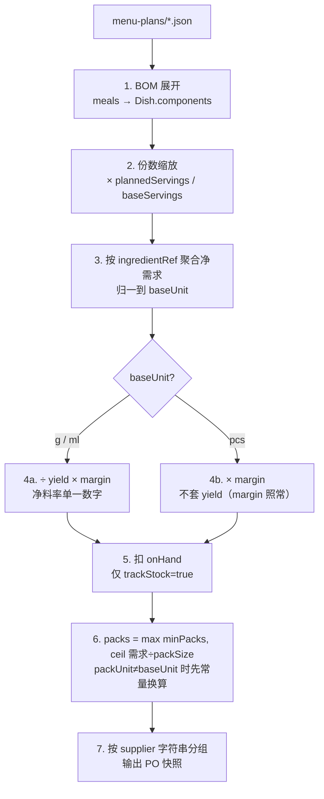

# 模块二：菜单计划 → 采购单引擎（Procurement Engine）

> **English summary.** The engine turns a MenuPlan (date × meal type × dish × servings, plus a `margin` buffer defaulting to 1.1) into purchase-order snapshots grouped by the supplier *string* on each ingredient's `purchase` spec. Pipeline per line: expand & scale (`plannedServings/baseServings`) → aggregate net need in `baseUnit` → for g/ml items divide by the single `yield` number; multiply by `margin` for **all** items including pcs (pcs skip yield only — ADR-0006, corrected 2026-09-06) → deduct `onHand` when `trackStock` → `packs = max(minPacks, ceil(need / packSize))`. Every line carries a full `trace` (which dishes, how many servings, net need, yield, margin, stock deduction, raw pack count, minPacks flag); POs are stateless engine-output snapshots — confirming/ordering/receiving happens offline (WeChat/phone) and never enters the data model. Worked example with numbers: `data/menu-plans/week-41.json` → the acceptance table in `data/purchase-orders/README.md`.

- 关联决策：[../adr/0006-scope-reduction-v2.md](../adr/0006-scope-reduction-v2.md)（v2 收窄；PO 状态机已删除）；[../adr/0005-procurement-engine-design.md](../adr/0005-procurement-engine-design.md)（确定性纯函数核心等原则仍然有效，但其中七步管线与 PO 状态机口径以本文为准）
- schema：`menu-plan.schema.json`、`purchase-order.schema.json`
- 代码骨架：`packages/core/src/procurement/engine.ts`

---

## 1. 数据模型表

### MenuPlan（菜单计划）——`data/menu-plans/<id>.json`

| 字段 | 类型 | 必填 | 说明 |
|---|---|---|---|
| schemaVersion | `"2"` | ✅ | |
| name | I18nString | | |
| dateRange | {start, end} | | ISO date |
| margin | number >0 | | 备量系数，**默认 1.1**：防少买系数，吸收固定尾料/挂壁损耗（场景 D 的 fixed_per_batch 收窄）；**作用于所有食材（含 pcs）**——只有 yield 不作用于 pcs（2026-09-06 修正） |
| meals[] | object | ✅ ≥1 | date + mealType(breakfast/lunch/dinner) + dishRef + plannedServings |

### PurchaseOrder（采购单快照）——`data/purchase-orders/<id>.json`

| 字段 | 类型 | 必填 | 说明 |
|---|---|---|---|
| schemaVersion / generatedAt | — | ✅ | 引擎生成时间由调用方注入（纯函数） |
| supplier | string | ✅ | 供应商名字符串（= `ingredient.purchase.supplier`，分组键，非实体引用） |
| menuPlanRef | Id | | 来源菜单计划 |
| lines[] | object | ✅ ≥1 | ingredientRef + qty + packs + unitPrice?/amount? + **trace（必带）** |
| totalAmount | Money | | Σ lines.amount |

**trace 字段（每行完整推导链）**：`meals`（哪个菜、多少份）→ `netNeed`（净需求，baseUnit 计）→ `yieldApplied`（÷ 的净料率，pcs/无 yield 为 null）→ `marginApplied`（× 的备量系数，**所有食材均有值**——margin 对 pcs 同样生效）→ `onHandDeducted`（扣的现有量，trackStock=false 为 null）→ `grossNeed`（取整前需求）→ `packSize/packUnit` → `packsRaw`（未取整值）→ `minPacksApplied`。

无状态机：PO 是引擎输出快照；确认/下单/收货在线下完成，不进数据模型。

## 2. 关键流程



### 伪代码（与 `packages/core/src/procurement/engine.ts` 骨架一一对应）

```text
function expand(menuPlan, dishes, ingredients):
    margin = menuPlan.margin ?? 1.1
    # 1-2. BOM 展开 + 缩放
    requirements = []
    for meal in menuPlan.meals:
        dish = dishes[meal.dishRef]                # 缺失 → issue missing-dish
        dish.status == active 否则跳过              # issue dish-not-active
        scale = meal.plannedServings / dish.baseServings
        for comp in dish.components:
            requirements.push({meal, comp, qty: comp.qty × scale})

    # 3. 聚合：归一到 baseUnit 后按 ingredientRef 求和
    #    pcs↔g 只靠 ingredient.pcsToGram；g↔kg、ml↔l 是代码常量；
    #    无法换算 → issue unit-conversion-missing，绝不猜测
    netNeed = aggregate(requirements)

    # 4-6. 逐食材出采购行
    for ref, net in netNeed:
        ing = ingredients[ref]
        marginApplied = margin                     # margin 对所有食材生效（防少买系数，2026-09-06 修正）
        if ing.baseUnit == "pcs":
            need = net * margin                    # pcs：不套 yield，照常乘 margin
            yieldApplied = null
        else:
            need = net / (ing.yield ?? 1) * margin # 写法固定：净需求 ÷ yield × margin
            yieldApplied = ing.yield ?? null
        if ing.trackStock:                         # 5. 扣现有量
            onHandDeducted = min(need, ing.onHand ?? 0)
            need -= onHandDeducted
        # 6. 包装取整（packUnit ≠ baseUnit 时先 g↔kg / ml↔l 常量换算）
        packsRaw = need / ing.purchase.packSize    # 无 purchase → 归入「未指定供应商」单 + issue no-purchase-spec
        packs = max(ing.purchase.minPacks ?? 1, ceil(packsRaw))
        line.trace = {meals, netNeed, yieldApplied, marginApplied,
                      onHandDeducted, grossNeed, packSize, packUnit, packsRaw,
                      minPacksApplied: packs > ceil(packsRaw)}
    # 7. 按 supplier 字符串分组 → PurchaseOrder 快照
```

### 完整推导样例（data/ 数字自洽，引擎黄金测试）

`data/menu-plans/week-41.json`：番茄炒蛋 200 + 160 + 120 = **480 份**；`baseServings = 50`，scale = 9.6；margin = **1.1**。
配方（每 50 份）：番茄 7500 g、鸡蛋 75 pcs、食盐 75 g、小葱 250 g、食用油 500 ml。

| 食材 | 净需求（聚合） | ÷yield | ×margin | 扣 onHand | ÷packSize | 取整/minPacks | 采购量 | 金额 |
|---|---|---|---|---|---|---|---|---|
| 番茄 | 480×150 = 72000 g | ÷0.85 | ×1.1 = 93176.5 g | 0（trackStock=false） | ÷5 kg = 18.64 | ceil → 19 | **19 件 × 5 kg = 95 kg** | 19×28.5 = ¥541.50 |
| 鸡蛋 | 480×1.5 = 720 pcs | —（pcs 不套 yield） | ×1.1 = 792 pcs | 0 | ÷180 枚 = 4.4 | ceil → 5 | **5 箱 × 180 = 900 枚** | 5×150 = ¥750.00 |
| 小葱 | 480×5 = 2400 g | ÷0.80 | ×1.1 = 3300 g | 0 | ÷1 kg = 3.3 | ceil → 4 | **4 件 × 1 kg = 4 kg** | 4×12 = ¥48.00 |
| 食盐 | 480×1.5 = 720 g | ÷1（无 yield） | ×1.1 = 792 g | −500 = 292 g | ÷500 g = 0.584 | ceil → 1，minPacks → 20 | **20 袋 × 500 g = 10 kg** | 20×2.5 = ¥50.00 |
| 食用油 | 480×10 = 4800 ml | ÷1（无 yield） | ×1.1 = 5280 ml | −1000 = 4280 ml | ÷5 L = 0.856 | ceil → 1，minPacks → 2 | **2 桶 × 5 L = 10 L** | 2×68 = ¥136.00 |

按供应商分单：**绿源农产品配送** ¥1339.50（番茄+鸡蛋+小葱）、**宏达粮油调味批发** ¥186.00（食盐+食用油），合计 **¥1525.50 / 480 份 ≈ ¥3.18/份**。

margin 作用点（全仓库统一口径）：**净需求聚合之后，与 ÷yield 同一步（乘除可交换，trace 固定记 `yieldApplied`/`marginApplied` 两个字段），扣 onHand 之前；margin 对所有食材生效，pcs 食材仅跳过 yield**（2026-09-06 修正，原口径"pcs 不乘 margin"为设计错误，见 ADR-0006 §3 更正备注）。数字同时回填在 `data/purchase-orders/README.md`，作为引擎实现的验收基准。

## 3. 分享与交付形态（场景 F）

- **纯文本微信消息是第一交付物**（菜贩可直接复制/语音念）：一个供应商一段，`品名 数量 单位` + 预估总价（按 lastPrice，标"预估"避免纠纷）；「未指定供应商」的食材单独成组标黄。
- 图片是增强：PWA 内用 html-to-image（MIT）出 PNG，Web Share API / 长按保存进微信。
- PO 快照文件只进 git（审计追溯用）；给菜贩看的永远是从快照渲染出的文本/图片。

## 4. 边界情况

| 情况 | 处理 |
|---|---|
| 配料 unit = to-taste（适量，G2） | 不进采购行、不进 pending 区（不编造数字）；备料单照常显示「适量 / to taste / за смаком」 |
| 食材缺 purchase 信息 | 归入「未指定供应商」单照常出单 + issue `no-purchase-spec` 标黄（场景 F：Grocy 同构行为），不整单失败 |
| 单位无法换算（如 ml 食材包装按 g 登记） | issue `unit-conversion-missing`，该行跳过，**绝不猜测**；g↔kg、ml↔l 是代码常量，pcs↔g 只靠 pcsToGram |
| minPacks 大于需求（盐 292 g vs minPacks 20×500 g） | 按 minPacks 下单；trace 记 `minPacksApplied: true`（多余量即库存补充） |
| trackStock=false | 不扣库存（鲜货天天买，没有"现有量"概念） |
| 菜品缺 components/baseServings | 该 meal 跳过 + issue `dish-incomplete`（readiness「能排/能采」不过）；其余菜照常 |
| 菜品非 active | 该 meal 跳过 + issue `dish-not-active` |
| 需求为 0（菜单全被跳过） | 不出单；issues 全量保留 |

## 5. 开放问题（Open Questions）

1. `lastPrice` 的更新入口（采购员买完改 ingredient 文件走 PR？）与"跳过 0/空值"规则由谁执行。
2. margin=1.1 的小批量适用性（10 份量级固定尾料占比高）——上线实测后校正默认值或引入分量段。
3. 分阶段链式 yield（场景 D 的完整模型，如番茄"去皮 0.85 × 去尾料 −20 g/批"）何时值得引入——出现实测偏差再以新 ADR 扩展。
4. 采购频次与菜单周期不一致（叶菜隔天买、粮油按月买）是否要在 purchase 里加 `buyEvery` 提示。
