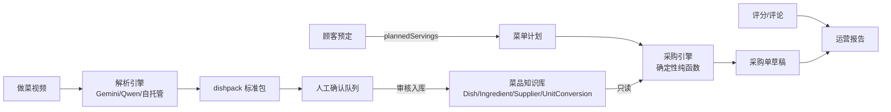
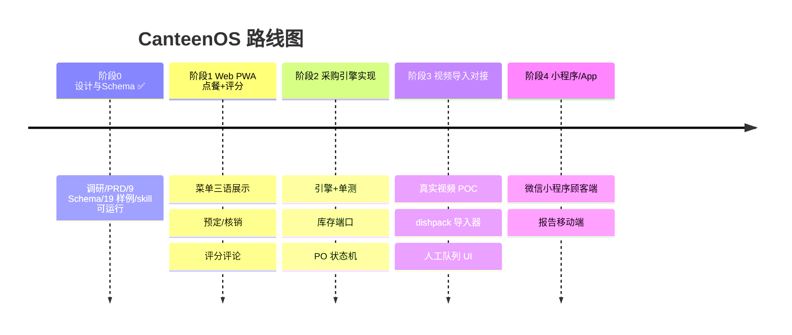

# CanteenOS 项目总结（2026-09）

> **English summary.** CanteenOS is an open-source, spec-first system covering the full canteen chain: dish knowledge base → menu planning → auto-generated purchase orders → customer ordering & ratings → operations reports. It is content-level trilingual (zh/en/uk) and ships a working "cooking video → structured recipe (dishpack) → knowledge base" skill with three pluggable AI engines. Current status: Phase 0 complete (research, 9 JSON Schemas, 19 validated examples, collaboration conventions, runnable video-ingest skill); next step is real-world validation. Repository: https://github.com/TERRYYYC/canteen-os

---

## 1. 一句话定位

**CanteenOS 是一个贯穿食堂全链路的开源系统：菜品知识库 → 菜单计划（日/周/月）→ 自动生成采购单 → 顾客点菜与评分 → 运营报告。**

两个硬性差异化：

- **内容级三语**（中文 / English / Українська）——不是界面翻译，是数据本身带三语；
- **做菜视频 → 结构化菜谱 → 打包导入知识库**——解析跑在云端（Gemini/Qwen 可插拔），本地只导入标准包。

## 2. 背景与要解决的问题

食堂场景中四个真实痛点：

| 痛点 | 现状 | CanteenOS 的解法 |
|---|---|---|
| 厨师与采购的沟通断层 | 菜单在厨师脑子里/微信里，采购靠经验估算 | 菜单计划一键推演成采购单（模块二） |
| 菜谱知识不沉淀 | 师傅离职带走手艺，菜谱是"番茄适量" | 结构化菜品知识库，BOM 级精确（模块一） |
| 多语言环境 | 中/英/乌员工与顾客并存，现有软件只翻译界面 | 内容级三语数据模型 |
| 新菜上线慢 | 看到好菜谱视频，靠人工整理成采购口径 | 视频解析 skill 自动生成候选菜品 |

## 3. 市场调研结论（调研了约 40 个开源项目）

> 完整报告：[docs/research/open-source-research-canteen-system.md](research/open-source-research-canteen-system.md)（200 行）、[docs/research/video-to-recipe-tech-survey.md](research/video-to-recipe-tech-survey.md)（145 行），全部来源 URL 在附录。

### 3.1 开源格局

| 类别 | 代表项目 | 结论 |
|---|---|---|
| 菜谱管理 | Mealie（13.1k⭐，AGPL）、Tandoor（8.5k⭐，AGPL+Commons Clause 禁商用）、Grocy（9.4k⭐，MIT） | 全是家庭场景；协议不允许商用 fork，只借鉴数据模型 |
| 菜单→清单 | Mealie / Grocy / KitchenOwl | 终点全是**家庭购物清单**：无供应商、无 MOQ、无库存抵扣 |
| 食堂点餐 | itsHenry35/canteen-management-system（学校 AB 餐） | 角色模型最贴近，但许可"严禁商用"；中国高校毕设类无协议不可复用 |
| 供应链 | OpenKitchen（2⭐）、Odoo MRP | "BOM 展开→按供应商→采购单"应参照 Odoo 范式 |

### 3.2 三个开源空白（= 我们的产品位）

1. **"菜单计划→采购单转换"无人做开源**——菜谱软件不懂采购，ERP 不懂菜谱语义，中间地带只存在于闭源产品（如 Apicbase）；
2. **内容级三语无人做**——Mealie/Tandoor 界面有 40 种语言，食材库只有英文（其社区明确吐槽）；
3. **"三语视频 + 批量打包导入自有知识库"无人做**——现有视频转菜谱工具都是单条导入第三方实例。

### 3.3 视频技术选型

| 路线 | 单条成本（3 分钟视频） | 三语支持 | 结论 |
|---|---|---|---|
| **Gemini 2.5 Flash**（首选） | $0.02–0.05，有免费档 | ✅ 音轨直接理解 | 原生 JSON Schema 约束输出，工程量最小 |
| Qwen3-VL（备选） | <¥0.5 | 中/英强，乌语待实测 | 国内合规，接口同构 |
| 自托管 WhisperX+Qwen-VL | 边际 <$0.01，工程 3–6 人周 | ✅ | 仅月处理 >1 万条时考虑 |
| Twelve Labs | ~$0.10+索引费 | ❌ 无乌克兰语 | 排除 |

## 4. 产品设计：三大模块

### 4.1 模块一：菜品知识库

实体模型：**Dish（菜品）/ Ingredient（食材·调料）/ Supplier（供应商+SKU）/ UnitConversion（量纲转换）/ DishPack（导入包）**。

- 菜品 = BOM（物料清单）：每个成分**引用食材实体**并带 `{value, unit}` 数量，而非"番茄 300 克"这种字符串——这是采购引擎能聚合的前提；
- 状态机：`draft → review → published`，版本化；
- 可扩展性：视频解析 skill 产出 dishpack 标准包，经**人工确认队列**入库——AI 无权直接写知识库。

### 4.2 模块二：菜单计划 → 采购单引擎（核心护城河）

七步确定性管线：

```
菜单计划（日期×餐次×菜品×计划份数）
  → ① BOM 展开        → ② 按 计划份数/基准份数 缩放
  → ③ 应用损耗率      → ④ 按食材聚合（量纲归一，按菜单日期取生效换算规则）
  → ⑤ 扣减库存        → ⑥ 按供应商包装/MOQ 向上取整（量纲换算）
  → ⑦ 按供应商拆分为 PO 草稿（draft→confirmed→ordered→received→settled）
```

- **确定性核心 + 可插拔边缘**：引擎是纯函数（同输入必同输出，可单测、可复算）；"有多少人来吃饭"的预测是注入端口，初期人工填，后期接订餐数据；
- **端到端对账样例**：番茄炒蛋 480 份 → 鸡蛋需求 720 枚 → 损耗率 0.89 → 809 枚 → 按 180 枚/箱取整 5 箱 → 两家供应商 PO 合计 1360 元 ≈ 2.83 元/份——文档推导与 JSON 样例数字逐格一致，CI 保证不腐化。

**量纲三元组（菜品 × 食材 × 量纲转换）**——动态可调整的单位换算体系：

- 优先级链：**菜品特定 > 食材特定 > 全局通用**（例：全局 kg→g；食材级"鸡蛋 1 pcs = 55 g"；菜品级可覆盖"番茄炒蛋里番茄 1 pcs = 150 g"）；
- 规则不原地修改：新版本 `supersedes` 旧版本 + 生效区间，采购引擎**按菜单日期取当日生效规则**——调整量纲不污染历史采购单，历史永远可复算。

### 4.3 模块三：点餐 / 评分 / 反馈

- 顾客预定点餐 → 直接驱动采购引擎的"计划份数"（数据闭环）；
- 1–5 星 + 标签 + 评论（评论存原文+翻译，三语展示）；
- 周/月运营报告四板块：菜品榜（热度×口碑）、采购准确度、成本分析、浪费反馈。

### 4.4 视频导入 skill（已可运行）

```
做菜视频（中/英/乌） → 解析引擎（fixture / Gemini / Qwen 可插拔）
  → schema.org/Recipe JSON-LD → 字符串→食材实体映射（置信度标注）
  → dishpack 标准包 → 置信度 <0.85 字段进人工确认队列 → 审核入库
```

- 引擎可插拔，产出统一契约；换引擎不动主系统；
- 每条食材映射带置信度与原文转写溯源（可回放视频时间段核对）。

## 5. 技术架构

### 5.1 四个架构支柱

1. **Spec-first**：`schemas/`（9 个 JSON Schema，draft 2020-12）是单一事实源；类型、样例、文档、代码全部从它派生；变更顺序硬性规定 **schema → types → examples → docs**，CI 用 ajv 强制校验样例与 schema 一致；
2. **三个数据决策不可妥协**：① 可展示文本一律 `I18nString {zh, en, uk}`；② 菜品成分必须引用食材实体；③ 数量一律 `{value, unit}`，换算走量纲表；
3. **确定性核心 + 可插拔边缘**（采购引擎纯函数，预测/库存是注入端口）；
4. **格式先行，引擎可替换**（dishpack 契约与 Gemini/Qwen/自托管解耦）。

### 5.2 模块边界（只准通过 schema 实体通信）



边界规则刻意"绝情"：采购引擎只读知识库；视频 skill 必须过人工队列；顾客反馈只通过预定份数间接影响采购。每个模块可由不同人/agent 独立开发。

### 5.3 技术选型

| 决策点 | 选型 | 理由 |
|---|---|---|
| 数据模型 | JSON Schema draft 2020-12 | 语言中立、ajv 可 CI 校验 |
| 仓库结构 | pnpm workspaces monorepo | core/web/api 共享 schema |
| 核心语言 | TypeScript | 前后端同构，类型与 schema 直接映射 |
| 菜谱交换格式 | schema.org/Recipe JSON-LD | 事实标准，Mealie/Tandoor 兼容 |
| 视频解析 | Gemini 2.5 Flash 首选 / Qwen3-VL 备选 | 成本 $0.02–0.05/条，三语 |
| 许可证 | Apache-2.0 | 对照 Tandoor Commons Clause 禁商用的教训（ADR-0002） |

## 6. 当前进展（截至 2026-09-05）

| 里程碑 | 状态 |
|---|---|
| 市场调研（2 份报告，约 40 个项目） | ✅ 完成 |
| 仓库脚手架（PRD/架构/5 篇 ADR/协作规范） | ✅ 完成 |
| 9 个 JSON Schema + 19 个样例（全部通过校验） | ✅ 完成 |
| 视频解析 skill 可运行（三引擎+fixture+专属 CI） | ✅ 完成（真实 API 待密钥验证） |
| 量纲三元组实体 + 动态调整语义 | ✅ 完成 |
| CI（schema 校验 + skill 端到端） | ✅ 已修复基线 bug 并验证 19/19 |

仓库实况：2 个 commit，GitHub 私有仓库 [TERRYYYC/canteen-os](https://github.com/TERRYYYC/canteen-os)。

30 秒体验（无需任何密钥）：

```bash
git clone https://github.com/TERRYYYC/canteen-os && cd canteen-os
python3 skills/video-recipe-ingest/scripts/parse_video.py --input fixtures --engine fixture --output /tmp/dishpack.json
python3 skills/video-recipe-ingest/scripts/validate_dishpack.py /tmp/dishpack.json
python3 scripts/local-validate.py   # 19 个样例全部 PASS
```

## 7. 诚实清单：已验证 vs 未验证

**已验证**（有 CI 或实际运行背书）：schema↔样例一致性（19/19）、fixture 端到端管线、质量门槛自动生效（低置信度字段正确进入人工队列）、采购推导数字对账。

**未验证**（明确标注，不掩饰）：

1. ⚠️ **Gemini/Qwen 真实 API 调用**——adapter 代码完整但本环境无密钥，未实测；
2. ⚠️ **乌克兰语视频抽取质量**——无公开 benchmark，需 POC；
3. ⚠️ **食堂真实需求**——开源空白可能是机会，也可能市场已被闭源 ERP 覆盖；
4. ⚠️ **"计划份数"可知性**——若师傅靠看剩菜决定次日产量，引擎输入端为空；
5. ⚠️ **供应商 SKU/MOQ 数据维护成本**——运营负担而非技术问题。

**下一步两个最便宜的现实测试**：① 配 GEMINI_API_KEY 跑一条真实做菜视频（验证 1、2）；② 拿真实食堂一周菜单手动推演采购单给师傅看（验证 3、4、5）。

## 8. 路线图



顺序有依赖逻辑：阶段 1 的订餐数据是阶段 2 采购份数预测的数据源；客户端形态（App/小程序/网页）被刻意推迟——schema 与核心逻辑与客户端无关。

## 9. 协作方式（人类与 AI agent 一视同仁）

- **AGENTS.md**：AI agent 进仓库必读——仓库地图、变更顺序、禁止事项（不引入 AGPL 依赖、不提交密钥）；
- **5 篇 ADR**：重大决策留痕（许可证、spec-first、内容级三语、采购引擎设计），不同意就写新 ADR 推翻，不扯皮；
- **3 类 Issue 模板**（含"菜品数据贡献"模板——非技术人员也能按 schema 贡献食材数据）+ PR checklist + CODEOWNERS；
- **双 CI**：schema 一致性校验（任何数据变更）+ skill 端到端 fixture 测试（任何 skill 变更）。

## 10. 仓库导航

| 内容 | 路径 |
|---|---|
| 产品需求 PRD | [docs/prd.md](prd.md) |
| 总体架构 | [docs/architecture.md](architecture.md) |
| 模块一·菜品知识库 | [docs/modules/knowledge-base.md](modules/knowledge-base.md) |
| 模块二·采购引擎 | [docs/modules/procurement.md](modules/procurement.md) |
| 模块三·评分反馈 | [docs/modules/feedback.md](modules/feedback.md) |
| 量纲三元组 | [docs/modules/unit-conversion.md](modules/unit-conversion.md) |
| 视频导入设计 | [docs/video-import.md](video-import.md) |
| 视频解析 skill（可运行） | [skills/video-recipe-ingest/](../skills/video-recipe-ingest) |
| 数据模型单一事实源 | [schemas/](../schemas)（9 个 JSON Schema） |
| 校验样例 | [examples/](../examples)（19 个，CI 通过） |
| 调研报告 | [docs/research/](research) |
| 决策记录 ADR | [docs/adr/](adr)（0001–0005） |

---

*本文档为 2026-09-05 快照。仓库当前为 private，外部分享需所有者邀请协作者或转为 public。*
