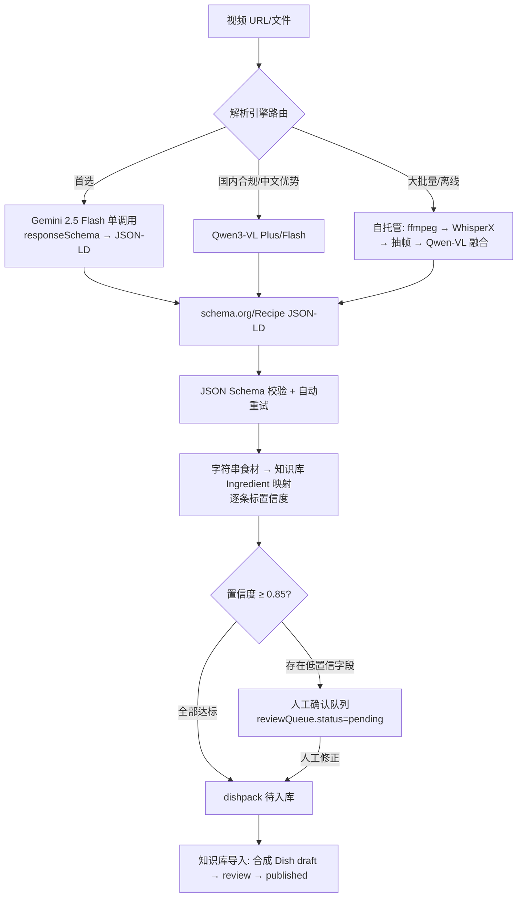

# 视频导入：解析 skill 规范

> **English summary.** The video-import pipeline turns cooking videos (zh/en/uk narration or subtitles) into structured recipes and packs them into importable **dishpack** bundles. Parsing runs off-device — primary route: a single Gemini 2.5 Flash call constrained by responseSchema to emit schema.org/Recipe JSON-LD (~$0.02–0.05 per 3-minute video); fallbacks: Qwen3-VL (China compliance / Chinese advantage) and a self-hosted WhisperX + Qwen-VL pipeline (bulk / offline). All engines share one output contract ("format first, parser replaceable"). Error-prone fields (quantities, servings) carry confidence scores; anything below the 0.85 threshold enters a human review queue before knowledge-base import. Full cost/engineering analysis: [research/video-to-recipe-tech-survey.md](research/video-to-recipe-tech-survey.md).

- skill 契约（供实现方）：[skills/video-recipe-ingest/SKILL.md](../skills/video-recipe-ingest/SKILL.md)
- 交换格式 schema：`schemas/dishpack.schema.json`

---

## 1. 输入契约

| 字段 | 类型 | 说明 |
|---|---|---|
| `videoUrl` 或视频文件 | uri / binary | 支持 youtube / bilibili / douyin / tiktok / instagram / local-file |
| `languageHint` | `zh` / `en` / `uk` / 空 | 旁白语言提示，提高解析与翻译质量 |
| `targetLanguages` | 默认 `[zh, en, uk]` | 输出三语内容 |

## 2. 管线

关键设计（引调研报告 §6"架构决策要点"）：

1. **标准包格式锁定 schema.org/Recipe JSON-LD**，解析引擎可插拔（Gemini / Qwen / 自托管同一输出契约）。
2. **保留溯源**：包内附原始视频 URL、原文转写（transcript）、逐段时间戳（stepMapping.timestampRange）。
3. **人机闭环**：用量/份量等易错字段带置信度，导入前设人工确认队列。
4. **字幕优先**：视频自带字幕轨时直接抽取，成本最低错误最少，ASR 兜底。

## 3. 输出契约：dishpack 标准包

结构（完整定义见 `schemas/dishpack.schema.json`，样例见 `examples/dishpack-tomato-egg.example.json`）：

| 字段 | 内容 |
|---|---|
| `packVersion` | 标准包格式版本（当前 `"1"`），独立于实体 schemaVersion |
| `generator` | 引擎标识：`engine ∈ {gemini-flash, gemini-pro, qwen-vl, self-hosted-pipeline, manual}` + 版本 + promptVersion |
| `source` | videoUrl、platform、detectedLang、durationSeconds |
| `manifest.recipe` | schema.org/Recipe JSON-LD 原始输出（recipeIngredient 为纯字符串） |
| `manifest.ingredientMappings[]` | 字符串 → `ingredientRef` + `Quantity` + `confidence` + `needsReview` |
| `manifest.stepMapping[]` | i18n 步骤 + 视频时间段 |
| `manifest.suggestedDish` | 三语名称、分类、基准份数建议 |
| `manifest.overallConfidence` | 整体置信度 |
| `transcript` | 原文转写（lang + text + 可选 segments） |
| `media[]` | 关键帧/封面引用 |
| `reviewQueue` | `pending/approved/rejected` + reasons |

### 字符串 → Ingredient 映射（本系统与 schema.org 的关键差异）

schema.org/Recipe 的 `recipeIngredient` 是纯字符串数组（"番茄 300 克"），数量/单位/名称不分字段——适合做**交换格式**，不能做内部存储（调研报告 §六）。因此：

- 解析 skill 必须把每条字符串拆成 `(ingredientRef, Quantity, confidence)`；
- 映射到**已有**知识库 Ingredient（词典/模糊匹配）；匹配不到时 `ingredientRef` 留空、`needsReview=true`，由人工确认是新建食材还是映射修正；
- 这是 Dish.components 用引用而非内联字符串（采购引擎前提）在导入侧的对应义务。

## 4. 置信度与人工确认队列

- 阈值默认 **0.85**（per-field）；`needsReview = confidence.value < 阈值`。
- 入队原因（`reviewQueue.reasons`）示例：`low-confidence-ingredient`、`unit-conversion-missing`、`ingredient-not-in-kb`。
- 队列人工操作：确认 / 修正映射 / 改用量 / 拒绝整包。
- 加固措施（调研报告 §6）：JSON schema 校验 + 自动重试；疑难样本升级 Gemini Pro 二次精修；历史上 Gemini 非英语 JSON 输出有编码 bug（已修复），生产中仍需校验兜底。

## 5. 成本估算（引调研报告，2026-05~09 快照）

| 路线 | 单条边际成本 | 工程投入 | 适合阶段 |
|---|---|---|---|
| Gemini Flash（首选） | **$0.02–0.05**（免费档可开发） | 1–2 人周 | POC → 生产 |
| Qwen3-VL / 豆包 | ¥0.1–0.5 | 低 | 国内合规 |
| Gemini Pro | $0.10–0.30 | 低 | 疑难样本兜底 |
| 自托管 WhisperX+Qwen-VL | < $0.01 + GPU 固定成本 | 3–6 人周 + 运维 | 数万条/月、离线 |

经验法则：**月处理量 < 1 万条时云端 API 全面占优**（月成本 < $500，零运维）。价格以官方控制台实时报价为准。

## 6. POC 验证计划

1. 拿 10–20 条真实目标视频（**含乌克兰语样本**）在 Gemini 免费档跑通；
2. 用 [pick-a-recipe](https://github.com/pickeld/pick-a-recipe)（MIT）做基线对比；
3. 中文场景参考 [TsaiHao/recipe-from-video](https://github.com/TsaiHao/recipe-from-video)（B 站/抖音 → 结构化中文食谱，与本需求几乎同构）；
4. 重点实测：乌克兰语抽取质量、用量字段准确率、术语归一（cup↔ml、тісто↔面团）。

## 7. 开放问题（Open Questions）

1. 人工确认队列的 SLA 与责任角色（厨师还是管理员）？
2. ingredientMappings 匹配不到现有食材时，自动新建 Ingredient 草稿还是必须人工建？
3. 批量导入（一次 100 条视频）的队列与配额管理策略？
4. Cooklang 附件是否纳入 dishpack v2（便于人工审阅/Git 管理）？
