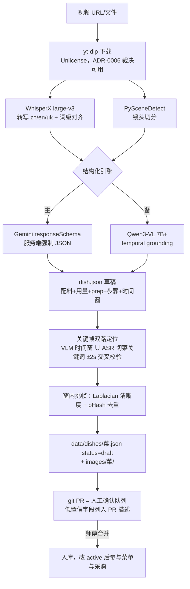

# 视频导入：解析 skill 规范

> **English summary.** The video-import pipeline turns cooking videos (zh/en/uk narration or subtitles) directly into knowledge-base drafts: **`data/dishes/<dish>.json` (status=draft) + an `images/<dish>/` directory of keyframes — no interchange bundle anymore** (v2, [ADR-0006](adr/0006-scope-reduction-v2.md)). A git PR is the human review queue; merging accepts the dish. Downloads use yt-dlp (Unlicense, ruled acceptable); parsing is **Gemini primary / Qwen fallback**, with WhisperX word-level alignment and PySceneDetect + sharpness scoring for keyframe extraction. Every ingredient's "seconds being cut" frame lands in `component.prep.image`; every step carries a `clip{videoUrl,start,end}` range; technique references are a closed set from `data/techniques.json`; low-confidence fields (<0.85) are listed in the PR description for the chef. Full research: [research/v2/scenario-c](research/v2/scenario-c-video-to-dishpack-keyframes.md) and [research/video-to-recipe-tech-survey.md](research/video-to-recipe-tech-survey.md).

- skill 契约（供实现方，**以它为准**）：[skills/video-recipe-ingest/SKILL.md](../skills/video-recipe-ingest/SKILL.md)
- 输出格式 schema：`schemas/dish.schema.json`；样例：`data/dishes/tomato-egg-stir-fry.json`

---

## 1. 输入契约

| 字段 | 类型 | 说明 |
|---|---|---|
| `videoUrl` 或视频文件 | uri / binary | youtube / bilibili / douyin / tiktok / instagram / local-file；下载统一走 yt-dlp（锁版本 + 高频升级 + 失败回放） |
| `languageHint` | `zh` / `en` / `uk` / 空 | 旁白语言提示，提高解析与翻译质量 |
| `targetLanguages` | 默认 `[zh, en, uk]` | 输出三语内容（zh 权威，en/uk 机翻初稿） |

## 2. 管线

关键设计：

1. **直出菜品文件，无中间包**（v2 收窄）：解析引擎的中间产物（如 schema.org/Recipe JSON-LD）是引擎内部细节，不再是仓库契约；仓库契约就是 `dish.schema.json` + 本文件。
2. **保留溯源**：`provenance.videoUrl` + 每步 `clip{start,end}`（秒），备料/教学可回放。
3. **人机闭环**：`components[].confidence` < 0.85 的字段在 PR 描述逐条列出；PR 合并即人工确认完成。
4. **技法闭集**：`techniqueRef` 只能是 `data/techniques.json` 里的 id（SKILL.md §3）。
5. **字幕优先**：视频自带字幕轨时直接抽取，成本最低错误最少，ASR 兜底。

## 3. 引擎选型与裁决（ADR-0006）

| 决策 | 结论 | 依据 |
|---|---|---|
| 下载器 | **yt-dlp 可用**（Unlicense = 公有领域奉献，宽松度等同 MIT；B 站/抖音/YouTube 唯一稳的开源底座） | 场景 C §4 |
| 解析引擎 | **Gemini 主**（responseSchema 强制 JSON、免 GPU、$0.02–0.05/条）/**Qwen 备**（Apache-2.0、可自托管、中文强） | 场景 C §3、调研报告成本分析 |
| ASR | WhisperX（BSD-2）+ Whisper large-v3；uk FLEURS WER ≈ 9.5%，无更优开源对手 | 场景 C §1/§5 |
| 抽帧 | PySceneDetect（BSD-3）+ Laplacian 清晰度 + pHash 去重 | 场景 C §2 |
| 动作识别 | 不上专用模型（EPIC-KITCHENS 为 CC BY-NC，只看不取）；用 VLM 时间窗 + ASR 关键词双路定位 | 场景 C §2 |

## 4. 成本估算（引调研报告，2026-05~09 快照）

| 路线 | 单条边际成本 | 工程投入 | 适合阶段 |
|---|---|---|---|
| Gemini Flash（主） | **$0.02–0.05**（免费档可开发） | 1–2 人周 | POC → 生产 |
| Qwen3-VL / 百炼（备） | ¥0.1–0.5 | 低 | 国内合规 |
| Gemini Pro | $0.10–0.30 | 低 | 疑难样本兜底 |
| 自托管 WhisperX+Qwen-VL | < $0.01 + GPU 固定成本 | 3–6 人周 + 运维 | 数万条/月、离线 |

经验法则：**月处理量 < 1 万条时云端 API 全面占优**。价格以官方控制台实时报价为准。

## 5. POC 验证计划（ADR-0006 执行顺序：先引擎后 POC，本节属 POC）

1. 拿 10–20 条真实目标视频（**含乌克兰语样本**）在 Gemini 免费档跑通；
2. 中文场景参考 [TsaiHao/recipe-from-video](https://github.com/TsaiHao/recipe-from-video)（B 站/抖音 → 结构化中文食谱，与本需求几乎同构）、[pick-a-recipe](https://github.com/pickeld/pick-a-recipe)（MIT，管线完整）做基线对比；
3. 重点实测：乌克兰语抽取质量（数字/用量字段单独统计错误率）、技法闭集命中率、截帧可用率（"被切的几秒"是否真的拍到了切）。

## 6. 开放问题（Open Questions)

1. 批量导入（一次 100 条视频）时 PR 噪音如何控制（批量分支 + 汇总 PR？）。
2. 配料映射不到现有食材时，skill 是否可在同一 PR 附带新建 `data/ingredients/<新>.json` 草稿（当前约定：允许，但必须在 PR 描述列出）。
3. 截帧图片的体积上限与压缩管线（场景 G 已知坑 #1：git 不是图床，需源头压缩 + 硬上限）。
